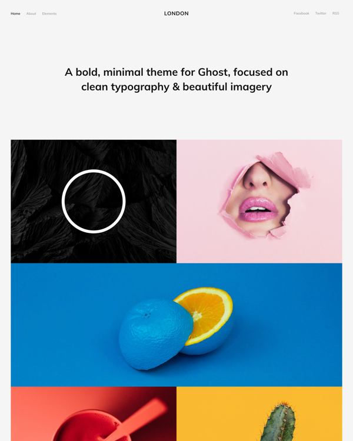

<!-- AUTO-GENERATED-CONTENT:START (STARTER) -->
<p align="center">
  <a href="https://www.gatsbyjs.org">
    
  </a>
</p>

<h1 align="center">
  London

[](https://app.netlify.com/start/deploy?repository=https://github.com/gatsbyjs/gatsby-starter-blog)

</h1>

---

A custom, image-centric theme for Gatsby. Made for publishers and portfolios with plenty of graphics to show off to the world. Completely free and fully responsive, released under the MIT license.

**Based on [London](https://github.com/TryGhost/London) for Ghost**

**Demo: https://gatsby-london.netlify.com**

<p align="center">
  <a href="https://gatsby-london.netlify.com">
    
  </a>
</p>

---

_I haven't really spent any time adding the JS animations or removing any unused CSS (automatically done by PurgeCSS). You will also need HTML in your Markdown file in order to add CSS classes to your images_

---

_First time with Gatsby? Take a look on the [official and community-created starters](https://www.gatsbyjs.org/docs/gatsby-starters/)._

## 🚀 Quick start

1.  **Create a Gatsby site.**

    Use `npx` and the Gatsby CLI to create a new project

    ```sh
    # create a new Gatsby site using the blog starter
    npx gatsby new my-awesome-portfolio https://github.com/ImedAdel/gatsby-london
    ```

1.  **Start developing.**

    Navigate into your new site’s directory and start it up.

    ```sh
    cd my-awesome-portfolio/
    gatsby develop
    ```

1.  **Open the source code and start editing!**

    Your site is now running at `http://localhost:8000`!

    _Note: You'll also see a second link: _`http://localhost:8000/___graphql`_. This is a tool you can use to experiment with querying your data. Learn more about using this tool in the [Gatsby tutorial](https://www.gatsbyjs.org/tutorial/part-five/#introducing-graphiql)._

    Open the `my-blog-starter` directory in your code editor of choice and edit `src/pages/index.js`. Save your changes and the browser will update in real time!

<!-- AUTO-GENERATED-CONTENT:END -->

## TypeScript

This site is written in TypeScript (`.ts`/`.tsx`) end to end — pages, components,
Gatsby config files (`gatsby-config.ts`, `gatsby-node.ts`, …), and the build
verification tests.

- **Builds** rely on Gatsby's built-in TypeScript support, which strips types
  via Babel — so types are **not** checked during `develop`/`build` (no speed
  cost). Run the dedicated type check yourself:

  ```sh
  npm run typecheck   # tsc --noEmit, strict mode
  ```

  It also runs automatically on commit (husky pre-commit) and as the first step
  of `npm run verify`.

- **GraphQL types** are generated by Gatsby's GraphQL Typegen
  (`graphqlTypegen: true`) into `src/gatsby-types.d.ts` (committed). The global
  `Queries.*` namespace gives fully-typed query results
  (e.g. `PageProps<Queries.HomePageQuery>`).

  Regenerating this file requires a **full Gatsby bootstrap** — there is no
  standalone typegen command, so you must run `gatsby develop` or
  `gatsby build` (e.g. `npm run develop` / `npm run verify:build`) to refresh
  it. Whenever you add or change a `graphql` query (in a page, template,
  `gatsby-config.ts`, `gatsby-node.ts`, etc.), re-run one of those and
  **commit the regenerated `src/gatsby-types.d.ts` in the same change**.
  Because the file is committed, a fresh clone can `npm run typecheck` without
  building first — but it also means the committed types can silently drift
  from the schema if a regeneration is left uncommitted. `npm run verify`
  rebuilds before type-checking, so it surfaces drift; after any build,
  `git status` should be clean (no stray `gatsby-types.d.ts` changes left
  behind).

- **Tests** under `tests/build/` are `.ts` and run on Node's native type
  stripping — no `ts-node`/`tsx` needed:

  ```sh
  node --test tests/build/*.test.ts
  ```
