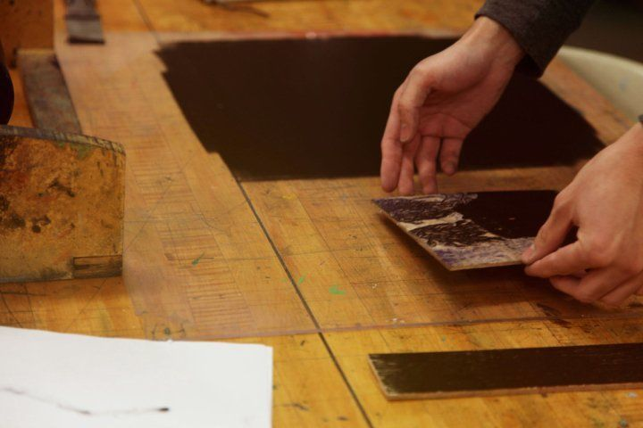
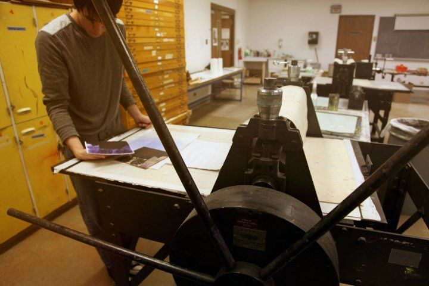
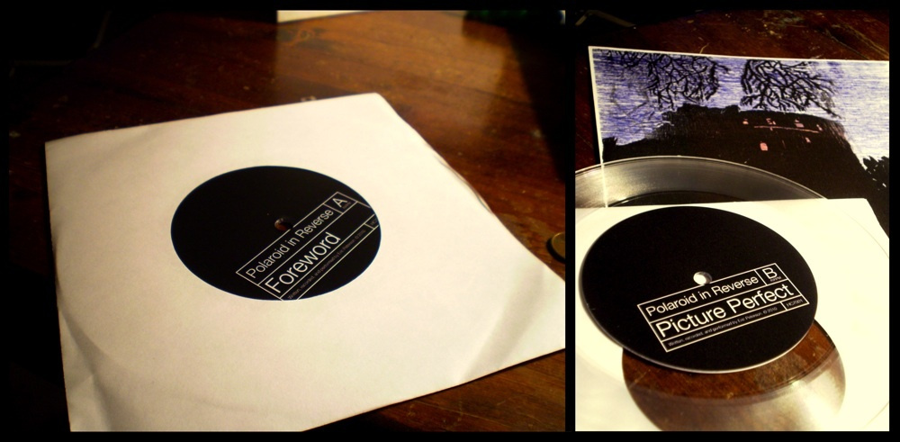

<iframe width="100%" height="210" src="//bandcamp.com/EmbeddedPlayer/album=23354821/size=large/bgcol=ffffff/linkcol=0687f5/artwork=small/transparent=true/" seamless="" frameborder="0"></iframe>

---

Everyone dreams, in the literal sense. Most of us are familiar with the experience that follows when we awake: as our morning progresses, we forgot more and more of last night's dream until eventually, we barely remember we even had it in the first place. From 2006 to 2010, in an experiment to preserve my dreams, I documented them in writing with as much detail as I could. Despite logging my dreams as soon as I awoke, and in great detail, I quickly realized even my written accounts were only incomplete fragments. They were like polaroids, but instead of having developed into clear images out of nothing, they'd degraded from a perfect picture into only a dull memory.

Memory too fades with time. We do our best to resist this tendency through documentation: photographs, videos, journals, blogs. But we rarely stop to ask: is there value in documentation or is memory's degradation insurmountable?

 

  

  

  

  

Polaroid in Reverse explores some of these themes through not only the music and lyrics themselves, but also in its presentation. While traditionally pressed records are stamped out using heavy duty industrial equipment and have relative longevity, lathe cut records such as this are individually carved in real-time, one-by-one, and last only a fraction of the time pressed records do. Each time you play this record, the quality degrades slightly, until eventually, it's rendered totally unplayable. The cover art was also hand printed using a technique called wood cut reduction printing which is similarly destructive.

> Eric Peterson's final record in his brief but influential career as a Denver musician was lathe-cut rather than pressed in the traditional manner. As a consequence, the record is more delicate and will bear the marks of repeated listens; the songs will become fuzzier and eventually disappear entirely into white noise. And in that way, the record embodies its message: Polaroid in Reverse offers a contemplation on the world's ceaseless entropy.
>
> ~ [Westword Best Use of the LP Format 2011](https://www.westword.com/best-of/2011/arts-and-entertainment/best-use-of-the-lp-format-5158203)

<a href="https://gum.co/jTkiw/5mte3lf?wanted=true" target="_blank" class="gumroad-button button fit" data-gumroad-single-product="true">Download for Free</a>
