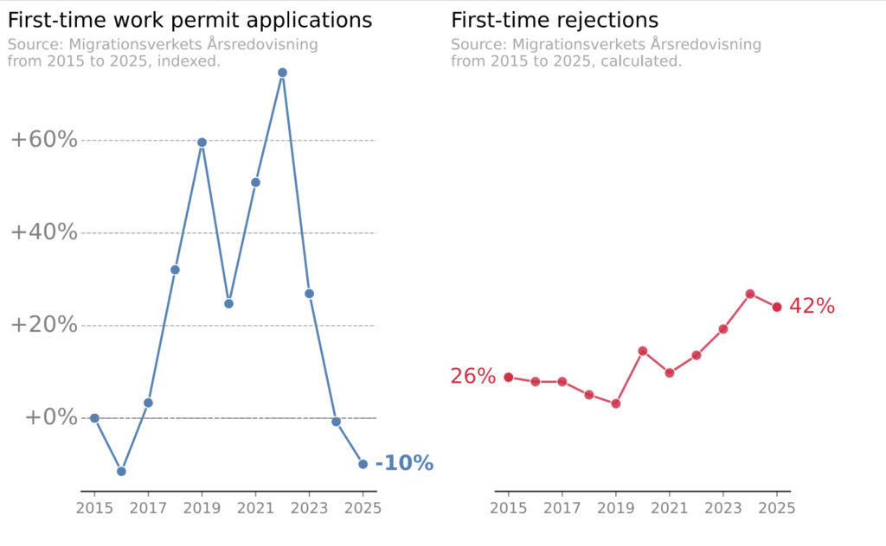
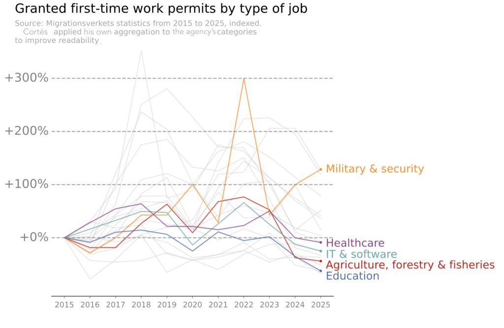

|                        |                                                                                                                                                                    |
| :--------------------- | :----------------------------------------------------------------------------------------------------------------------------------------------------------------- |
| **Author**             | Eric Peterson                                                                                                                                                      |
| **Updated**            | Oct 8th, 2026                                                                                                                                                      |
| **Status**             | Mitigation in progress                                                                                                                                             |
| **Impact**             | Over 100,000 pending citizenship applicants assessed under requirements introduced after they were filed. Processing times of nearly 5 years[^1]. Denials ongoing. |
| **Duration**           | In force since June 6th, 2026; ongoing                                                                                                                             |
| **If you're affected** | [Fair Transition][fair-transition] is coordinating legal and political efforts                                                                                     |

**Jump to:** [Summary](#summary) · [Impact](#impact) · [Incident overview](#incident-overview) · [Mitigations](#mitigations) · [Root cause analysis](#root-cause-analysis) · [What went well, poorly, and lucky](#what-went-well-what-went-poorly-and-where-we-got-lucky) · [Remediation and next steps](#remediation-and-next-steps) · [Lessons](#lessons) · [Appendix](#appendix) · [Key documents](#key-documents)

## Summary

On April 29th, 2026, I sat in the public gallery of the Swedish parliament and watched a proposal fail by a single vote. It would have spared the 100,000+ people already waiting for citizenship, me included, from stricter new rules. Only hours later, over a consolation meal at Taco Bell (I was feeling more American than Swedish at that point), did I learn why it failed: two MPs from the far-right Sweden Democrats had broken a century-old parliamentary norm to cast votes they had agreed not to cast.

The law took effect on June 6th. Among other things, it raised the residence requirement from five to eight years and added self-sufficiency, language and civics requirements. Because it was passed with no transitional rules (provisions that would have let pending applications be judged under the old requirements; in software terms, a "migration path"), it applies to [everyone already in the queue][queue-passes-100k]. Applications filed under the old requirements are [now being denied][rejections-exceed-approvals] under the new ones.

This document, written like a [software postmortem][sre-postmortem-culture], examines two efforts to change that outcome: my own economic case against the reform, submitted during public consultation in 2025, and the campaign for transitional rules that came within one vote. The [lessons](#lessons) at the end are written for anyone facing similar reforms elsewhere.

None of this disputes the prerogative of an elected government, backed by a parliamentary majority, to tighten citizenship rules. But a legitimate change can still be a costly one, and a mandate for stricter rules is not obviously a mandate to apply them retrospectively[^2].

### Key findings

- **A coalition dependent on the far right prioritized its own stability over arguments designed to fit its economic philosophy**. The center-right governing parties made it clear throughout their term that skilled labor migration was a priority, but my economic argument, aligned to this goal, moved none of them before the vote. The coalition's stability took priority.
- **A narrow ask came within one vote, where a broad one moved no one**. Asking only for transitional rules let a majority form outside the government once conditions shifted, and long-shot outreach to independent MPs paid off when two of them crossed over.
- **The real decision was made long before the public debate began**. A coalition agreement signed in 2022 committed the government to a firmly defined citizenship reform before any proposal went out for comment.
- **Labor migrants lack institutional representation**. Unions and employer groups each cover part of their interests, but neither speaks fully for their shared need for predictability. The gap has persisted across governments and puts efforts like mine at a structural disadvantage.

<small>[↑ Back to top](#top)</small>

## Impact

In Sweden, the typical path for a labor migrant or researcher runs from temporary permits to permanent residency to citizenship. Every status[^3] short of citizenship is conditional: organizational restructuring, an economic downturn, or a change in the law can end it. Only citizenship removes that risk in absolute terms, so the conditions for acquiring it, especially the timeline, matter to people years before they qualify.

War on Europe's doorstep, great-power rivalry, and democratic backsliding in once-stable democracies have made the security of citizenship more valuable and its absence more costly in recent years.

For the more than 100,000 people impacted, the new law means:

- **Lives on hold**. People who planned housing, careers, etc. around five years now face eight, plus language and civics requirements the state can't yet fully test.
- **Constrained travel**. Time abroad can delay citizenship further. If for example care for a sick parent is needed, it becomes a painful calculation.
- **No EU mobility**. For non-EU nationals, Swedish citizenship is also EU citizenship.
- **No national or EU representation**. Only citizens can participate in national and EU parliamentary elections.
- **Lost belonging and trust**. A rejection from the Migration Agency is a stressful experience: a letter from the state formally denying belonging. Sweden has effectively queued up a drip campaign of tens of thousands of such letters.

<small>[↑ Back to top](#top)</small>

## Incident overview

Impact unfolded in five phases.

| Phase           | When            | What happened                                                                                                                                                                                                                                       |
| :-------------- | :-------------- | :-------------------------------------------------------------------------------------------------------------------------------------------------------------------------------------------------------------------------------------------------- |
| Latent defect   | Oct 2022        | The Tidö agreement, the coalition deal between the three center-right governing parties (the Moderates, Christian Democrats and Liberals) and the Sweden Democrats, commits the coalition to stricter citizenship requirements (among other things) |
| Degradation     | 2025–2026       | Introduction of enhanced security checks, following a public row within the coalition over pausing citizenships, eventually pushes the application queue past 100,000; 75th percentile processing times soar to nearly 5 years                      |
| Change approved | Apr 29th, 2026  | Parliament passes the bill 258–33; the opposition's transitional-rules proposal fails 147–146                                                                                                                                                       |
| Deployment      | Jun 6th, 2026   | The law takes effect without transitional rules                                                                                                                                                                                                     |
| Ongoing impact  | Jun 2026 onward | Pending applications are assessed and denied under the new requirements                                                                                                                                                                             |

<small>[↑ Back to top](#top)</small>

## Mitigations

### Approach A: the economic case

I moved to Sweden in September 2020 to work in tech. I made that choice based in part on a spreadsheet I built to evaluate and rank candidate countries. Salary and career prospects were in it, but so too were time to permanent residency, time to citizenship, language factors, and democracy scores. Stability and predictability were explicit criteria.

This is not unique to me. Andrew Stetsenko, who has spent 15 years placing tech workers in jobs abroad through relocate.me, [observed in April 2026][relocateme-substack] that relocation decisions are now driven more by stability and quality of life than by pay and career prospects. Swedish employers have [long reported][techsverige-report] that they can't find the skilled workers they need, especially in tech.

In Sweden, before a bill is drafted, the government commissions an inquiry whose proposal is published and sent out for comment in a process called _remiss_. For those in the software world, it works much like an RFC: anyone may respond, including individuals and groups the government did not invite.

The inquiry's proposal ([SOU 2025:1][sou-2025-1]) went out for remiss in January 2025. Unlike the final bill, it included transitional rules and a modest income requirement of about €610 per month. Both were soon under pressure: on February 4th, migration minister Johan Forssell told the press he intended to ["skip transitional rules"][forssell-skip-transitional-rules][^4], and on March 20th, a [supplementary proposal][supplementary-proposal] nearly tripled the income requirement to about €1,750.

Meanwhile, the government had ordered enhanced security checks on citizenship applications. Forssell [assured The Local][minister-reassures-labor-migrants], an English-language news site in Sweden, that the checks would not slow applications down or affect labor migrants. In the end, they slowed processing for everyone.

Concerned that the stability that initially attracted me to Sweden was evaporating, and that no one seemed to be doing anything about it, I felt compelled to act. On about March 24th, I began circulating a draft letter among immigrant friends and colleagues, and a week later I submitted [this response][my-remiss-response] to the Justice Ministry with 379 signatures from migrants in Swedish tech, ranging from individual contributors to founders, executives, and investors.

My response argued that the longer residence requirement, new language requirements and self-sufficiency rules would erase Sweden's advantage in competing for skilled labor. To someone directly affected, the line from cause to effect was self-evident: when a country worsens the terms, fewer people will choose it, and when it retrospectively applies those terms to people already part-way through the process, some of them will choose to leave. The response closed with a call for transitional rules. I made an economic case because it was the one I could make credibly, and it was one the governing parties said they cared about. Of course, the law itself doesn't distinguish: everyone in the queue, whatever route they took to Sweden, is assessed under the new rules.

The signatures gave the response a legitimacy that my comments alone would have lacked. That ultimately led to [an op-ed in Svenska Dagbladet][svd-op-ed] (SvD), a major center-right paper, in May 2025; a published [reply to the migration minister's own op-ed][svd-reply-to-minister] that August (to which he did not respond); meetings with politicians and ministerial staff, conversations with tech executives and investors, and subsequent interviews in various other media outlets.

None of this produced a visible change in any governing party's position before the vote.

The argument was at least mentioned in the government's bill. [Prop. 2025/26:175][prop-2025-26-175] noted that "several private individuals[^5]" warned that a longer residence requirement could lead people to choose other countries, costing Sweden valuable skills. However, the bill did not respond to that point anywhere in its text.

There are signs the argument registered, just not in time. Within two weeks of the bill reaching parliament, the opposition Center Party [proposed a fast-track][center-party-fast-track] to citizenship for people who pay a certain amount in tax, and later made it a core part of its 2026 campaign. In August, Forssell's own party, the Moderates, proposed [a fast-track of their own][moderate-fast-track], granting citizenship after five years instead of eight to "talents[^6]."

### Approach B: the rights-based case

The second approach made its case in terms of fundamental rights and asked for much less: keep the stricter requirements, but don't apply them to applications already filed, regardless of how the applicant came to Sweden. It traces its roots to a separate [signature collection campaign][signature-campaign] by Patrick Gallen from 2025 asking for transitional rules, but coalesced around the independent [Fair Transition campaign][fair-transition] that formed in February 2026, around the same time that the Council on Legislation (a panel of senior judges whose review of draft laws is advisory) [heavily criticized][lagradet-opinion] the draft law for violating principles of legal certainty.

Fair Transition operated like most decentralized grassroots campaigns: social media, press releases and interviews, and direct outreach to members of parliament across bloc lines. At its core was a chaotic group chat that eventually grew to more than a thousand members, where volunteers proposed and executed on ideas in between political commentary and requests for assistance.

By early April, Annika Hirvonen (Green Party) and Niels Paarup-Petersen (Center Party), spurred in part by Fair Transition's efforts, got the four rarely united opposition parties aligned behind transitional rules. That left the seemingly impossible task of winning two more votes in a parliament where strict party discipline is the norm.

Meanwhile, the Liberals, a governing party founded on rule-of-law principles and polling badly in an election year, [had reversed their platform][liberals-accept-sd-ministers] and agreed to accept Sweden Democrat ministers after the election. The internal revolt that followed suggested that some MPs from the Liberal party might break rank. Most Fair Transition volunteers focused there. A smaller group emailed nine independent politicians: members who had left or been forced out of their parties but kept their seats.

In the end, two independents, Katja Nyberg and Elsa Widding, both former Sweden Democrats, switched sides and voted for transitional rules. Nyberg later [cited legal certainty and the emails she had received][nyberg-op-ed] as reasons why. That should have given transitional rules a majority.

But the Swedish parliament runs on pairing (_kvittning_): a century-old, cross-party agreement that matches absent members across blocs so that votes reflect the chamber's actual balance. Two Sweden Democrats, Michael Rubbestad and Charlotte Quensel, had been paired out of the vote and voted anyway, cancelling out the independents' votes. [The opposition's proposal failed][transitional-rules-fail] 147–146. Breaking the pairing agreement was [unprecedented][pairing-break-unprecedented].

The opposition tried twice to force a new vote, first through a committee initiative and then an emergency motion. Both failed, the second when the Speaker ruled, [with the chamber's backing][speaker-upholds-ruling], that a broken pairing agreement didn't justify one. The law came into force on June 6th without transitional rules.

<small>[↑ Back to top](#top)</small>

## Root cause analysis

Neither mitigation approach persuaded the governing parties. [Approach A](#approach-a-the-economic-case)'s ask had no majority anywhere; the bill itself passed 258–33 with most of the opposition in favor. [Approach B](#approach-b-the-rights-based-case) came close only because its narrow ask could unite a majority without them, once conditions shifted in the final weeks.

### Root cause: the decision was made upstream

Ultimately, the [Tidö agreement][tido-agreement] fixed the outcome before any public process began. Every element of the [inquiry's directive][dir-2023-129] maps point-by-point to what was written in the agreement, including the specific 8-year residency figure. Later changes only sharpened the law in the direction the Sweden Democrats wanted.

Even transitional rules were not a cheap concession for the governing parties. The Moderates framed a lack of transitional rules as a necessity for national security, echoing [the Security Service's own remiss response][sapo-remiss]. They later leveraged it as [a political attack][expressen-political-attack] on the Social Democrats, the largest opposition party, after the vote. The Sweden Democrats [campaigned on having blocked][sd-instagram-post] over 100,000 applicants from getting citizenship, pointing to how important the lack of transitional rules was to them.

By the time the proposal reached remiss, the governing parties could not change course without risking the stability of the coalition, whatever they privately believed about the economic cost.

### Systemic factor: labor migrants lack institutional representation

On paper, labor migrants—tech workers in particular—have powerful potential allies. Employers want to recruit and retain talent from abroad with as little friction as possible. Investors need a steady supply of talent for the Swedish tech ecosystem. White-collar unions have a growing immigrant membership.

All of these groups have strong, ongoing relationships with the parties that write this kind of legislation. The migration minister's own [nine-point talent agenda][talent-agenda], co-signed by executives from major Swedish employers, never mentioned citizenship. In practice, institutional engagement on citizenship rarely went beyond private support or referrals. When it did, it came too late: the white-collar union confederation TCO [backed transitional rules][unions-back-transitional-rules] only weeks before the vote.

These potential allies had more pressing priorities: companies avoided immigration as too touchy a subject, employer associations were busy fighting damaging work-permit legislation, and investors were focused on equity reforms and founder visas. Unions, with some exceptions, have traditionally focused more on protecting local labor than on the concerns of their migrant members[^7].

Without institutional allies, support and political awareness had to be built from scratch, far too late in the process. An established association representing labor migrants would at least have made it harder for politicians to overlook what this legislation would cost.

This isn't new. During the ["talent deportation" cases][talent-deportation-2021] of roughly 2016 to 2021, when skilled workers were deported over minor permit errors, grassroots efforts had to push a reluctant government into a fix without institutional backing.

### Contributing factors

- **Administrative slowdowns widened the impact**. Enhanced security checks, ordered shortly after the governing parties agreed to award fewer citizenships "to the extent possible" until the new law applied, pushed the queue past 100,000. Every month of added processing time put more people inside the window the law would reach.
- **Rule-of-law safeguards eroded at every legislative step**. With no constitutional court and a [tradition of judicial restraint][courts-rule-of-law], Sweden's remaining safeguards against overreach are process and norms. The government [dictated the outcome][dir-2023-129] to its own inquiry, set aside critical remiss responses, and overrode the Council on Legislation. When the Sweden Democrats [broke a century-old pairing norm][pairing-break-unprecedented] to win the vote, their coalition partners wouldn't even acknowledge wrongdoing[^8] in private talks[^9], and blocked a new vote.
- **The economic argument was just a forecast**. The evidence for it is a lagging indicator: work permit applications and renewals, GDP growth, etc. It was challenging to argue objectively when negative trends didn't materialize until the damage was done, and they could be plausibly attributed to macroeconomic trends instead.
- **The cost was invisible to employers**. Swedish AI startup [Lovable's head of people told SvD][svd-hard-to-recommend-sweden] (in an article that also quoted me) that once someone has decided to move, immigration rules are rarely what keeps them up at night. That's exactly the blind spot: employers only see candidates who already chose Sweden, never the ones who ruled it out.
- **Technical asks struggle for attention**. Transitional rules for citizenship applications got some press coverage, but with difficulty. In the same months, stories of teenagers being deported dominated migration coverage.

<small>[↑ Back to top](#top)</small>

## What went well, what went poorly, and where we got lucky

**What went well**

- **The signed remiss response worked as a credential** with national media and with ministerial staff.
- **Op-eds ran in a center-right newspaper**, reaching the audience an economic argument needed.
- **I could be the human story from day one**. Being personally affected meant I didn't have to find someone willing to go on record before making the case.
- **Journalists, The Local above all, made it possible to follow a legislative process** in my third language, and their reporting obtained information I could not have reached on my own.

**What went poorly**

- **Engagement started late**. Action began two and a half years after the coalition's plans were public, once the proposal was already out for comment. Outreach to politicians and institutional allies came long afterward, far too late to shape the law.
- **The ask was too broad**. Targeting the government made sense in 2025: it held a firm majority, and the opposition (especially the Social Democrats) was wary of looking soft on migration. But the response opposed the core changes and asked for transitional rules only secondarily, leaving even sympathetic voices inside the coalition nothing small to champion. The narrow ask by Fair Transition was better positioned to take advantage of political and parliamentary shifts in early 2026.
- **The effort was neither sustained nor coordinated**. Signature gathering stopped after one week and no real community formed around the signatories. Parallel efforts remained isolated until Fair Transition was formed.

**Where we got lucky**

- **The Liberals' agreement with the Sweden Democrats destabilized the governing bloc** in the bill's final weeks, giving the Fair Transition campaign hope to continue.
- **Public sentiment shifted**. From early 2026, [cases of teenagers facing deportation][teen-deportation-cases] alone to countries they barely knew drew sustained coverage and criticism across the political spectrum. Awful as they were, they shifted the debate from reducing immigration at any cost toward what was reasonable, which made a narrow ask like transitional rules easier to support.
- **Independents who had entered parliament on a far-right ticket voted for transitional rules**.

<small>[↑ Back to top](#top)</small>

## Remediation and next steps

The law is in force, and the incident is ongoing. Remediation is running on three time horizons.

### Short term: the courts

On September 10th, 2026, the Malmö migration court [rejected a pilot appeal][malmo-court-rejects-appeal] backed by Fair Transition, which argued that applying the new rules to pending applications violated legal certainty and equal treatment under the law. The court found parliament's intent clear.

An appeal was [lodged with the Migration Court of Appeal][appeal-lodged] on September 30th; that court will first decide whether to hear the case. This is happening now, but will take time to play out.

Other countries' courts may offer more. Portugal tightened its citizenship requirements around the same time, and its constitutional court found that applying the new residence timelines to pending applications would be unconstitutional. The final law [protects applications filed before it took effect][portugal-law-update].

### Medium term: political change

In the September 13th, 2026 election, the four [former opposition parties won][election-results-2026] 176 seats to the Tidö parties' 173. All four have said they want transitional rules and most see a need for a broader reset of migration law. Government formation is under way. With luck, these parties will re-introduce transitional rules.

### Long term: an organization with standing

A permanent, member-based association representing labor migrants around their shared interest in predictable rules, with a record of responding to every relevant proposal, would be positioned to brief parties before an election, while election platforms and coalition terms are still being written.

SULF, the union for university teachers and researchers, shows what that standing can buy: when Sweden tightened family immigration rules in 2026, it [won a narrow fix][sulf-family-law-qa] to how family income is assessed.

Such an organization would also be positioned to do something no existing institution can: ask labor migrants why they came, why they stay, and why they leave. The Migration Agency counts permits, and employers see only the people who apply. Annual member surveys and exit interviews with those leaving would turn arguments like mine from forecasts into evidence, and give policymakers and researchers a leading indicator rather than a lagging one.

Whether that would have changed the outcome here isn't knowable, but an economic cost is easier to negotiate around before a coalition commits to a policy than after.

Campaigns like Fair Transition show that the capacity to organize exists. Turning that capacity into a standing organization, before the next reform, is the most important next step.

<small>[↑ Back to top](#top)</small>

## Lessons

1. **Find where the decision is made and work backwards from there**. In a coalition government, that's the coalition agreement, which is itself informed by party platforms. By the time a proposal goes out for comment, the important choices are already locked. Keep an eye on election promises and platforms and reach relevant politicians while those are still being written.
2. **Do the parliamentary math, early**. Here, opposing the core reform never had a realistic majority: the bill eventually passed 258–33, and that was knowable in 2025. The math won't tell you what will become possible, but it will tell you what's _impossible_, and knowing that sooner means pivoting sooner.
3. **Define a narrow ask, and tailor the messaging**. A targeted fix to a law is more likely to succeed than an attempt to block it entirely, but it still needs votes from parties with different priorities. Here, rights-based arguments resonated with the left, economic arguments with the economically liberal Center Party, and rule-of-law arguments ultimately won over two votes from further right.
4. **Use the formal channel**. Most democracies have some version of Sweden's remiss: a public consultation or a committee hearing. Use it. It won't win on its own, but it buys credibility you can deploy elsewhere.
5. **The press needs a human story**. A procedural issue will struggle to get coverage without a face. Find affected individuals with compelling stories who are willing to speak and get them heard. You can be the first one.
6. **Say "yes, and"**. A volunteer campaign runs on energy, and people put energy into ideas they believe in. Messaging independents, who almost always vote with their former parties, looked like a waste of time, and it would have been easy for anyone to say so. Two of them ended up switching sides. When an idea is cheap and someone is motivated to pursue it, the most useful response may be to stay out of the way.
7. **Prepare a legal strategy before the law takes effect**. Sweden's first court deferred to parliament; Portugal's constitutional court protected pending applications. Know which kind of court you'll face, assess early what can be challenged, and have lawyers and test cases ready.
8. **Build infrastructure before you need it**. Every effort here started from zero. Don't just collect signatures: build a community. Ask supporters how they want to help, and keep track of it with their permission: who will share their story, who will write to a politician, who just wants updates. Give them somewhere to talk that's more organized than a chat thread.

The best time to organize is before the coalition agreement gets written. The second-best time is now.

If any of this resonates with you, I'd love to hear from you. If you're in Sweden and directly affected, Fair Transition is a good resource.

  <a class="button primary" href="&#109;&#97;&#105;&#108;&#116;&#111;&#58;&#73;&#46;&#97;&#109;&#64;&#101;&#114;&#105;&#99;&#46;&#112;&#101;&#63;&#115;&#117;&#98;&#106;&#101;&#99;&#116;&#61;&#84;&#104;&#101;&#37;&#50;&#48;&#105;&#109;&#109;&#105;&#103;&#114;&#97;&#110;&#116;&#37;&#50;&#48;&#101;&#120;&#112;&#101;&#114;&#105;&#101;&#110;&#99;&#101;&#37;&#50;&#48;&#105;&#110;&#37;&#50;&#48;&#83;&#119;&#101;&#100;&#101;&#110;">Let's talk</a>
  <a class="button" href="https://www.fairtransitionsweden.com/" target="_blank" rel="noopener noreferrer">Check out Fair Transition</a>

<small>[↑ Back to top](#top)</small>

## Appendix

### I. Timeline

Events are grouped into four types: decisions by government and parliament, warning signs that indicated where the reform was heading, responses that tried to change the outcome, and political shifts that changed the conditions around it.

| Date            | Type            | Event                                                                                                                                                                                                                                                                                                                                   |
| :-------------- | :-------------- | :-------------------------------------------------------------------------------------------------------------------------------------------------------------------------------------------------------------------------------------------------------------------------------------------------------------------------------------- |
| Sep 11th, 2022  | Political shift | [Election][election-results-2022]: the future Tidö parties win 176 seats to the opposition's 173; the Sweden Democrats become the largest party on the right                                                                                                                                                                            |
| Oct 14th, 2022  | Decision        | [The Tidö agreement][tido-agreement] is presented, committing the new coalition to citizenship reform (among other things)                                                                                                                                                                                                              |
| Sep 8th, 2023   | Decision        | Inquiry into stricter citizenship requirements ([Dir. 2023:129][dir-2023-129]) commissioned                                                                                                                                                                                                                                             |
| Jun 27th, 2024  | Decision        | Inquiry scope expanded ([Dir. 2024:63][dir-2024-63])                                                                                                                                                                                                                                                                                    |
| Nov 16th, 2024  | Warning sign    | Deputy prime minister [Ebba Busch suggests the Migration Agency should intentionally slow down the processing of citizenship applications][busch-slow-processing] in an interview with Aftonbladet                                                                                                                                      |
| Nov 19th, 2024  | Response        | Ebba Busch is [reported to parliament's constitutional committee][busch-reported-to-committee] for ministerial rule (influencing independent government agencies outside formal governmental instruments)                                                                                                                               |
| Nov 21st, 2024  | Warning sign    | Sweden Democrat leader Jimmie Åkesson goes further than Busch, [calling for a complete freeze on new citizenships][akesson-freeze-call]                                                                                                                                                                                                 |
| Nov 29th, 2024  | Warning sign    | [All four Tidö party leaders][tido-leaders-compromise] compromise, agreeing that fewer citizenships "to the extent possible[^10]" should be awarded until new rules apply                                                                                                                                                               |
| Jan 9–10, 2025  | Warning sign    | [Enhanced security checks ordered][security-checks-ordered]; the migration minister [tells labor migrants not to worry][minister-reassures-labor-migrants]                                                                                                                                                                              |
| Jan 14th, 2025  | Decision        | Inquiry report [SOU 2025:1][sou-2025-1] published and sent out for comment                                                                                                                                                                                                                                                              |
| Jan 25th, 2025  | Warning sign    | Migration minister calls the proposed income requirement [too low][forssell-income-too-low]                                                                                                                                                                                                                                             |
| Feb 4th, 2025   | Warning sign    | Migration minister signals to press that he will [skip transitional rules][forssell-skip-transitional-rules]                                                                                                                                                                                                                            |
| Feb 10th, 2025  | Response        | [Signature collection campaign][signature-campaign] begins, arguing exclusively for transitional rules in the citizenship bill.                                                                                                                                                                                                         |
| Mar 20th, 2025  | Decision        | [Supplementary proposal][supplementary-proposal] raises the income requirement nearly three-fold                                                                                                                                                                                                                                        |
| Mar 21st, 2025  | Warning sign    | Migration Agency [begins enhanced security checks][security-checks-begin]; the queue starts to grow                                                                                                                                                                                                                                     |
| Mar 21–31, 2025 | Response        | [Remiss response][my-remiss-response] drafted, signed by 379 people and submitted                                                                                                                                                                                                                                                       |
| May 6th, 2025   | Response        | [Op-ed in Svenska Dagbladet][svd-op-ed]                                                                                                                                                                                                                                                                                                 |
| Jun 5th, 2025   | Decision        | Parliament's [constitutional committee unanimously criticizes][committee-criticizes-pm] Ulf Kristersson (prime minister), Ebba Busch, and Johan Pehrson (then-leader of the Liberal party) for using the press in fall 2024 to influence processing of citizenship applications. The criticism has no legal or political ramifications. |
| Jun 26th, 2025  | Warning sign    | Migration minister, together with members of his business council, lays out a [government plan for talent attraction][talent-agenda], no mention of citizenship law                                                                                                                                                                     |
| Jul 29th, 2025  | Warning sign    | Migration minister Johan Forssell publishes op-ed in Svenska Dagbladet, [making the case for stricter rules for citizenship][forssell-op-ed-july].                                                                                                                                                                                      |
| Aug 5th, 2025   | Response        | [Reply to the migration minister][svd-reply-to-minister] in Svenska Dagbladet; no response                                                                                                                                                                                                                                              |
| Sep 30th, 2025  | Warning sign    | UHR (the Swedish Council for Higher Education—the organization tasked with developing language tests for citizenship) told the government in a progress report that [it would be impossible to meet the August 2026 deadline][civics-test-delay] for the first tests, suggesting 2028 as the earliest it could deliver a quality test.  |
| Feb 6th, 2026   | Decision        | The government [splits the time horizon][test-timeline-split] for knowledge requirement tests: the civics test will be ready no later than August 17th, 2026. The language test no later than October 1st, 2027.                                                                                                                        |
| Feb 10th, 2026  | Decision        | Draft law sent to the Council on Legislation                                                                                                                                                                                                                                                                                            |
| Feb 2026        | Response        | [Fair Transition][fair-transition] forms to campaign for transitional rules                                                                                                                                                                                                                                                             |
| Feb 20th, 2026  | Warning sign    | Council on Legislation [criticizes the lack of transitional rules][lagradet-opinion]                                                                                                                                                                                                                                                    |
| Feb–Jun 2026    | Political shift | [Teen deportation cases][teen-deportation-cases] dominate migration coverage                                                                                                                                                                                                                                                            |
| Mar 13th, 2026  | Political shift | Liberals [agree to accept Sweden Democrat ministers][liberals-accept-sd-ministers] after the election, many critical of the change [signal their resignations][liberal-mp-resignations]                                                                                                                                                 |
| Mar 13th, 2026  | Decision        | [Prop. 2025/26:175][prop-2025-26-175] delivered to parliament                                                                                                                                                                                                                                                                           |
| Mar 25th, 2026  | Political shift | [Center Party proposes a fast-track for citizenship][center-party-fast-track] in response to Prop. 2025/26:175, later adopting the idea as part of its core 2026 campaign strategy.                                                                                                                                                     |
| Mar 25th, 2026  | Response        | Migration minister [answers a written question][s-written-question] relaying games industry concerns about the lack of transitional rules; his answer points to faster work permits instead                                                                                                                                             |
| Mar 28th, 2026  | Response        | Story highlighting [the cost of stricter citizenship rules in Svenska Dagbladet][svd-hard-to-recommend-sweden]                                                                                                                                                                                                                          |
| Apr 2nd, 2026   | Response        | TCO and a local Unionen club [publicly back transitional rules][unions-back-transitional-rules], though covered lightly, if at all, by Swedish media                                                                                                                                                                                    |
| Apr 2026        | Warning sign    | Citizenship queue [passes 100,000][queue-passes-100k]; processing times increase, eventually reaching 56 months in June                                                                                                                                                                                                                 |
| Apr 13th, 2026  | Response        | Story in Svenska Dagbladet on [the impact of migration reforms on an AI consultant][ai-consultant-story]                                                                                                                                                                                                                                |
| Apr 14th, 2026  | Response        | [Debate article in Dagens Industri][di-debate-article] on talent leaving for lack of stability                                                                                                                                                                                                                                          |
| Apr 28th, 2026  | Political shift | All four opposition parties [put forward joint reservation][joint-reservation] (proposal) focused exclusively on transitional rules                                                                                                                                                                                                     |
| Apr 29th, 2026  | Decision        | [Transitional rules fail][transitional-rules-fail] 147–146; bill passes 258–33                                                                                                                                                                                                                                                          |
| Apr 29th, 2026  | Warning sign    | \#JuToo: lawyers [warn that rule-of-law safeguards in lawmaking are being eroded][jutoo-warning]                                                                                                                                                                                                                                        |
| May 2nd, 2026   | Warning sign    | In an opinion piece, migration minister Johan Forssell criticizes Social Democrats for voting with left-leaning parties [against Sweden's national security interests][expressen-political-attack].                                                                                                                                     |
| May 11th, 2026  | Political shift | In an op-ed in Dagens Nyheter, former-Sweden Democrat independent MP Katja Nyberg cites [emails and legal certainty][nyberg-op-ed] as to why she voted for transitional rules                                                                                                                                                           |
| May 19th, 2026  | Decision        | Committee initiative for a new vote is [rejected by the government majority][revote-rejected]                                                                                                                                                                                                                                           |
| May 29th, 2026  | Response        | [Emergency motion][emergency-motion] for a new vote filed                                                                                                                                                                                                                                                                               |
| Jun 3–4, 2026   | Decision        | Speaker rejects the motion; the chamber [upholds the ruling][speaker-upholds-ruling]                                                                                                                                                                                                                                                    |
| Jun 6th, 2026   | Decision        | Law takes effect without transitional rules. By July, media begins reporting that [rejections dwarf approvals][rejections-exceed-approvals]                                                                                                                                                                                             |
| Aug 6th, 2026   | Political shift | Moderate party proposes [5-year fast-track citizenship for "talents"][moderate-fast-track] during their election campaign                                                                                                                                                                                                               |
| Aug 15th, 2026  | Warning sign    | Around [a thousand people sit for a "trial" civics test][trial-civics-test] in Stockholm. There is [no indication][civics-test-faq] when the next exam will be held.                                                                                                                                                                    |
| Sep 10th, 2026  | Decision        | Malmö migration court [rejects a Fair Transition-backed appeal][malmo-court-rejects-appeal]                                                                                                                                                                                                                                             |
| Sep 13th, 2026  | Political shift | [Election][election-results-2026]: former opposition 176 seats, Tidö parties 173, a bloc-level reversal of 2022                                                                                                                                                                                                                         |
| Sep 30th, 2026  | Warning sign    | In a report, UHR [recommends postponing language tests][uhr-postpone-report] from Oct 2027 to autumn 2029 (for comprehension) and 2030 (for writing and speaking) at the earliest.                                                                                                                                                      |
| Sep 30th, 2026  | Response        | [Appeal lodged][appeal-lodged] by Fair Transition with the Migration Court of Appeal                                                                                                                                                                                                                                                    |

### II. Data

The following visualizations (reproduced with permission) were created by Alejandro Lozada Cortés and originally published with analysis by Mandy Pipher in the article "[IN DATA: Work permit applications to Sweden drop to pre-2016 levels][work-permit-data-article]" in The Local Sweden.

While it's difficult to attribute the data to specific policies, it's notable that work permit applications peaked in 2022—the year the Tidö government took power—and fell every year since then to levels not seen since 2016. Permits granted within IT & Software followed the same negative trend, at the same time that Swedish AI darlings like Lovable and Legora were growing rapidly. Work permit salary threshold hikes may account for some of the drop in applications, but most software jobs clear those thresholds with room to spare.

<small>[↑ Back to top](#top)</small>

## Key documents

All in Swedish unless otherwise noted.

- [The Tidö Agreement][tido-agreement] (pdf)
- [Directive commissioning an inquiry into stricter rules for citizenship][dir-2023-129] (Dir. 2023:129)
- [Supplementary directive to the inquiry][dir-2024-63] (Dir. 2024:63)
- [Report on the inquiry into stricter rules for Swedish citizenship][sou-2025-1] (SOU 2025:1)
- [My remiss][my-remiss-response-in-swedish] (or [in English][my-remiss-response])
- [Prop. 2025/26:175][prop-2025-26-175]
- [The Council on Legislation's opinion on Prop. 2025/26:175][lagradet-opinion] (pdf)

<small>[↑ Back to top](#top)</small>

[^1]: The Migration Agency keeps track of 75th percentile case handling times for citizenship cases, as well as other types of applications it processes. On the day the law entered into force, the site quoted [a 56-month processing time][migrationsverket-wait-times].

[^2]: Under Swedish law, the change isn't retroactive in the legal sense: no decisions already made are being reversed. It is retrospective, in that it changes the rules for applications already filed. People who met every requirement in force when they applied are being judged against requirements that didn't exist yet, and whether they were caught depended on how fast their case was processed.

[^3]: Yes, even permanent residence permits. They can be revoked if you are away from the country for more than a year. The Tidö parties also commissioned an inquiry proposing to [revoke permanent residency permits][sou-2025-99], including those held by EU long-term residents.

[^4]: My translation from the original subhead in Swedish, "Men migrationsminister Johan Forssell (M) vill gå längre än utredaren – och skippa övergångsregler." The subhead was based on Forssell's own words, "...det är viktigt när vi nu gör om hela medborgarskapslagstiftningen att de förändringarna träder i kraft direkt…" that it's important while rewriting citizenship legislation in its entirety that the changes come into force immediately.

[^5]: The full reference, "Flera privatpersoner anför bl.a. att en skärpning av hemvistkravet riskerar att leda till att personer väljer bort den svenska arbetsmarknaden till förmån för andra länder med mer förmånliga medborgarskapsregler, vilket kan leda till att Sverige går miste om värdefull kompetens."

[^6]: Translated from Swedish "talanger," which is a term commonly used in the context of high-skilled labor migration.

[^7]: [SULF][sulf-migration-law], which represents researchers, regularly lobbies on migration rules affecting its members, and at least one local union club publicly backed transitional rules.

[^8]: The Sweden Democrats argued they were taking responsibility for independents elected on their ticket, to preserve the balance of power set by the election. But under the Instrument of Government, MPs hold an individual mandate; the seats were never theirs.

[^9]: In [an interview with The Local][hirvonen-interview], Annika Hirvonen (Green Party) said that the three government parties "can't – even in a closed room without any audience – say to our face in front of the Sweden Democrats that the Sweden Democrats even broke the agreement."

[^10]: From full Swedish quote: "I den mån det är möjligt ska därför åtgärder vidtas för att hindra att fler svenska medborgarskap utfärdas, fram till dess att den nya lagstiftningen träder i kraft."

[//]: # "Link reference definitions below"
[ai-consultant-story]: https://www.svd.se/a/BxM3P0/migrationsverket-tog-hennes-pass-nu-overvager-ai-konsulten-att-lamna-sverige '{"target": "_blank", "rel": "noopener noreferrer"}'
[akesson-freeze-call]: https://www.aftonbladet.se/debatt/a/Ppa5l0/akesson-infor-totalstopp-for-nyamedborgarskap '{"target": "_blank", "rel": "noopener noreferrer"}'
[appeal-lodged]: https://www.thelocal.se/20261001/landmark-citizenship-rules-case-appealed-to-swedens-top-migration-court '{"target": "_blank", "rel": "noopener noreferrer"}'
[busch-reported-to-committee]: https://www.svt.se/nyheter/inrikes/ebba-busch-ku-anmals-av-miljopartiet '{"target": "_blank", "rel": "noopener noreferrer"}'
[busch-slow-processing]: https://www.aftonbladet.se/nyheter/a/5Er9wE/ebba-buschs-nya-krav-se-over-invandrares-ratt-att-rosta '{"target": "_blank", "rel": "noopener noreferrer"}'
[center-party-fast-track]: https://www.di.se/nyheter/c-snabbspar-till-medborgarskap-genom-betald-skatt/ '{"target": "_blank", "rel": "noopener noreferrer"}'
[civics-test-delay]: https://www.thelocal.se/20251204/sweden-has-plan-to-push-forward-citizenship-law-despite-test-delays '{"target": "_blank", "rel": "noopener noreferrer"}'
[civics-test-faq]: https://www.thelocal.se/20260723/everything-you-need-to-know-about-the-coming-civics-test-for-citizenship '{"target": "_blank", "rel": "noopener noreferrer"}'
[committee-criticizes-pm]: https://www.sverigesradio.se/artikel/ku-kritik-mot-statsministern-for-utspel-om-medborgarskap '{"target": "_blank", "rel": "noopener noreferrer"}'
[courts-rule-of-law]: https://www.dagensjuridik.se/opinion/domstolarna-maste-nu-forsvara-rattsstaten/ '{"target": "_blank", "rel": "noopener noreferrer"}'
[di-debate-article]: https://www.di.se/debatt/talangerna-valjer-bort-sverige-stabiliteten-saknas/ '{"target": "_blank", "rel": "noopener noreferrer"}'
[dir-2023-129]: https://www.regeringen.se/rattsliga-dokument/kommittedirektiv/2023/09/dir.-2023129 '{"target": "_blank", "rel": "noopener noreferrer"}'
[dir-2024-63]: https://www.regeringen.se/rattsliga-dokument/kommittedirektiv/2024/06/dir.-202463 '{"target": "_blank", "rel": "noopener noreferrer"}'
[election-results-2022]: https://en.wikipedia.org/wiki/Results_of_the_2022_Swedish_general_election '{"target": "_blank", "rel": "noopener noreferrer"}'
[election-results-2026]: https://valresultat.svt.se/2026/ '{"target": "_blank", "rel": "noopener noreferrer"}'
[emergency-motion]: https://www.riksdagen.se/sv/dokument-och-lagar/dokument/motion/overgangsregler-for-medborgarskap-en-ny_hd024194/ '{"target": "_blank", "rel": "noopener noreferrer"}'
[expressen-political-attack]: https://www.expressen.se/debatt/debatt-s-utnyttjar-rostkuppen-for-att-flytta-fokuset/ '{"target": "_blank", "rel": "noopener noreferrer"}'
[fair-transition]: https://www.fairtransitionsweden.com/ '{"target": "_blank", "rel": "noopener noreferrer"}'
[forssell-income-too-low]: https://www.sverigesradio.se/artikel/forsell-kraven-pa-medborgarskap-bor-skarpas-mer-an-vad-som-foreslas '{"target": "_blank", "rel": "noopener noreferrer"}'
[forssell-op-ed-july]: https://www.svd.se/a/MnV9b5/johan-forssell-vill-man-bli-svensk-medborgare-ska-man-kunna-forsorja-sig-sjalv '{"target": "_blank", "rel": "noopener noreferrer"}'
[forssell-skip-transitional-rules]: https://www.svd.se/a/8qV79A/forssell-skarpta-krav-for-medborgarskap-fran-dag-ett '{"target": "_blank", "rel": "noopener noreferrer"}'
[hirvonen-interview]: https://www.thelocal.se/20260601/the-wind-is-changing-top-green-mp-celebrates-victories-on-migration '{"target": "_blank", "rel": "noopener noreferrer"}'
[joint-reservation]: https://www.thelocal.se/20260428/swedens-opposition-submit-joint-text-on-transitional-rules-for-citizenship '{"target": "_blank", "rel": "noopener noreferrer"}'
[jutoo-warning]: https://www.dn.se/debatt/larmet-ljuder-satt-stopp-for-nedmonteringen-av-rattsstaten/ '{"target": "_blank", "rel": "noopener noreferrer"}'
[lagradet-opinion]: ./with-sources/lagradet-opinion.pdf '{"download": true}'
[liberal-mp-resignations]: https://www.tv4.se/artikel/tt-260315-liberalernaavhopp1-21d40a2c/pekas-ut-som-mojlig-ny-l-ledare-duckar-fragan '{"target": "_blank", "rel": "noopener noreferrer"}'
[liberals-accept-sd-ministers]: https://www.svt.se/nyheter/inrikes/mohamsson-om-snabba-vandningen-sd-har-forandrats '{"target": "_blank", "rel": "noopener noreferrer"}'
[malmo-court-rejects-appeal]: https://www.domstol.se/nyheter/2026/09/skarpta-krav-for-medborgarskap-galler/ '{"target": "_blank", "rel": "noopener noreferrer"}'
[migrationsverket-wait-times]: https://web.archive.org/web/20260606230048/https://www.migrationsverket.se/kontakta-oss/vantetider.html#svid10_2cd2e409193b84c506a311f7 '{"target": "_blank", "rel": "noopener noreferrer"}'
[minister-reassures-labor-migrants]: https://www.thelocal.se/20250110/labour-migrants-should-not-be-worried-about-citizenship-checks-minister '{"target": "_blank", "rel": "noopener noreferrer"}'
[moderate-fast-track]: https://www.dn.se/sverige/m-vill-locka-invandrare-i-valet-foreslar-snabbspar-for-medborgarskap/ '{"target": "_blank", "rel": "noopener noreferrer"}'
[my-remiss-response]: https://eric.pe/terson/writes/a-response-to-sou-2025-1/
[my-remiss-response-in-swedish]: https://eric.pe/terson/sv/writes/a-response-to-sou-2025-1/
[nyberg-op-ed]: https://www.dn.se/debatt/inte-sds-sak-att-saga-hur-jag-ska-rosta-i-riksdagen/ '{"target": "_blank", "rel": "noopener noreferrer"}'
[pairing-break-unprecedented]: https://www.svd.se/a/8pPbvG/stora-nyheten-i-kvittningskaoset-sverigedemokraterna-stoltserar-med-vad-de-har-gjort '{"target": "_blank", "rel": "noopener noreferrer"}'
[portugal-law-update]: https://www.sovereigngroup.com/news/portugal-nationality-law-update/ '{"target": "_blank", "rel": "noopener noreferrer"}'
[prop-2025-26-175]: https://www.riksdagen.se/sv/dokument-och-lagar/dokument/proposition/skarpta-krav-for-svenskt-medborgarskap_hd03175/html/ '{"target": "_blank", "rel": "noopener noreferrer"}'
[queue-passes-100k]: https://www.sverigesradio.se/artikel/swedens-migration-agency-on-how-they-will-implement-new-citizenship-rules-heres-what-you-need-to-know '{"target": "_blank", "rel": "noopener noreferrer"}'
[rejections-exceed-approvals]: https://www.sverigesradio.se/artikel/swedish-citizenship-more-rejections-than-approvals-after-rule-changes '{"target": "_blank", "rel": "noopener noreferrer"}'
[relocateme-substack]: https://relocateme.substack.com/p/the-tech-relocation-job-market-is '{"target": "_blank", "rel": "noopener noreferrer"}'
[revote-rejected]: https://www.sverigesradio.se/artikel/swedish-citizenship-transition-rules-revote-rejected '{"target": "_blank", "rel": "noopener noreferrer"}'
[s-written-question]: https://www.riksdagen.se/sv/dokument-och-lagar/dokument/svar-pa-skriftlig-fraga/kompetensforsorjningen-i-dataspelsbranschen_hd12601/ '{"target": "_blank", "rel": "noopener noreferrer"}'
[sapo-remiss]: ./with-sources/sapo-remiss.pdf '{"download": true}'
[sd-instagram-post]: ./with-sources/sd-we-stopped-100000.pdf '{"download": true}'
[security-checks-begin]: https://www.migrationsverket.se/en/news-archive/news/2025-03-21-the-swedish-migration-agency-increases-security-in-its-examination-of-citizenship-applications.html '{"target": "_blank", "rel": "noopener noreferrer"}'
[security-checks-ordered]: https://www.regeringen.se/pressmeddelanden/2025/01/regeringen-starker-sakerhetsperspektivet-i-medborgarskapsarenden/ '{"target": "_blank", "rel": "noopener noreferrer"}'
[signature-campaign]: https://www.mittskifte.org/petitions/ingen-retroaktivitet-i-den-nya-medborgarskapslagen '{"target": "_blank", "rel": "noopener noreferrer"}'
[sou-2025-1]: https://www.regeringen.se/rattsliga-dokument/statens-offentliga-utredningar/2025/01/sou-20251/ '{"target": "_blank", "rel": "noopener noreferrer"}'
[sou-2025-99]: https://www.regeringen.se/rattsliga-dokument/statens-offentliga-utredningar/2025/09/sou-202599/ '{"target": "_blank", "rel": "noopener noreferrer"}'
[speaker-upholds-ruling]: https://www.riksdagen.se/sv/dokument-och-lagar/dokument/protokoll/protokoll-202526132-torsdagen-den-4-juni_hd09132/html/ '{"target": "_blank", "rel": "noopener noreferrer"}'
[sre-postmortem-culture]: https://sre.google/sre-book/postmortem-culture/ '{"target": "_blank", "rel": "noopener noreferrer"}'
[sulf-family-law-qa]: https://www.thelocal.se/20261007/qa-how-will-swedens-new-family-immigration-law-affect-researchers '{"target": "_blank", "rel": "noopener noreferrer"}'
[sulf-migration-law]: https://sulf.se/sulf-tycker/migrationslagen-skadar-svensk-forskning/ '{"target": "_blank", "rel": "noopener noreferrer"}'
[supplementary-proposal]: https://www.regeringen.se/rattsliga-dokument/departementsserien-och-promemorior/2025/03/promemoria-med-kompletterande-forslag-till-sou-20251/ '{"target": "_blank", "rel": "noopener noreferrer"}'
[svd-hard-to-recommend-sweden]: https://www.svd.se/a/3ppkye/spotify-ingenjor-har-svart-att-rekommendera-sverige '{"target": "_blank", "rel": "noopener noreferrer"}'
[svd-op-ed]: https://www.svd.se/a/LMEMOJ/regeringen-vill-locka-talanger-men-gor-tvartom-skriver-eric-peterson '{"target": "_blank", "rel": "noopener noreferrer"}'
[svd-reply-to-minister]: https://www.svd.se/a/OoVRoV/sverige-skrammer-bort-kvalificerad-arbetskraft-skriver-eric-peterson '{"target": "_blank", "rel": "noopener noreferrer"}'
[talent-agenda]: https://www.government.se/opinion-pieces/2025/07/sweden-cant-wait-for-talent/ '{"target": "_blank", "rel": "noopener noreferrer"}'
[talent-deportation-2021]: https://www.thelocal.se/20200629/swedish-inquiry-told-to-put-an-end-to-talent-deportation '{"target": "_blank", "rel": "noopener noreferrer"}'
[techsverige-report]: https://techsverige.se/2024/02/ny-rapport-sverige-behover-arligt-tillskott-av-18-000-specialister-inom-tech-2/ '{"target": "_blank", "rel": "noopener noreferrer"}'
[teen-deportation-cases]: https://www.aftonbladet.se/nyheter/a/GxM8Vl/unika-siffran-92-tonarsutvisningar-pa-ett-ar '{"target": "_blank", "rel": "noopener noreferrer"}'
[test-timeline-split]: https://www.regeringen.se/pressmeddelanden/2026/02/regeringen-justerar-uppdraget-for-medborgarskapsprovet-i-svenska/ '{"target": "_blank", "rel": "noopener noreferrer"}'
[tido-agreement]: ./with-sources/tido-agreement.pdf '{"download": true}'
[tido-leaders-compromise]: https://www.dn.se/debatt/det-ska-bli-svarare-att-bli-svensk-medborgare/ '{"target": "_blank", "rel": "noopener noreferrer"}'
[transitional-rules-fail]: https://www.thelocal.se/20260429/swedens-parliament-rejects-transitional-rules-for-citizenship-bill '{"target": "_blank", "rel": "noopener noreferrer"}'
[trial-civics-test]: https://www.sverigesradio.se/artikel/first-citizenship-civics-test-held-this-weekend-pass-mark-still-not-decided '{"target": "_blank", "rel": "noopener noreferrer"}'
[uhr-postpone-report]: https://www.uhr.se/publikationer/publikationsbutiken/slutredovisning-om-inforandet-av-medborgarskapsprov '{"target": "_blank", "rel": "noopener noreferrer"}'
[unions-back-transitional-rules]: https://www.thelocal.se/20260402/swedish-union-leaders-warn-haphazard-citizenship-reforms-could-harm-international-reputation '{"target": "_blank", "rel": "noopener noreferrer"}'
[work-permit-data-article]: https://www.thelocal.se/20260625/in-data-work-permit-applications-to-sweden-drop-to-pre-2016-levels '{"target": "_blank", "rel": "noopener noreferrer"}'
